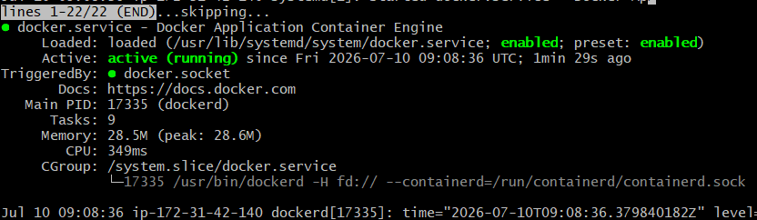
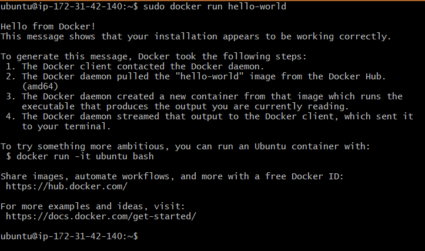

# 🚀 AWS DevOps Engineer Intern Assignment


## 📌 Assignment Overview

This project was completed as part of the **AWS DevOps Engineer Intern Assignment**.

The objective was to launch an AWS EC2 instance, configure a Linux server, deploy a static website using Nginx, manage the project with Git & GitHub, and document the complete implementation.

---

# 👨‍💻 Candidate Details

| Field | Details |
|-------|---------|
| **Name** | Jai Dev |
| **College** | Punjab Technical University |
| **Branch** | B.Tech – Computer Science Engineering |
| **Email** | jaidevvalmiki2244@gmail.com |
| **GitHub** | https://github.com/JaidevCodes |

---

# 🎯 Assignment Objectives

- Launch an Ubuntu EC2 Instance
- Configure Security Groups
- Connect via SSH
- Install and Configure Nginx
- Host a Static Website
- Perform Linux Administration Tasks
- Upload Project to GitHub
- Prepare Documentation

---

# ☁️ AWS Services Used

- Amazon EC2
- Amazon VPC
- Security Groups
- Internet Gateway

---

# 🛠 Tech Stack

- AWS EC2
- Ubuntu Linux
- Nginx
- HTML5
- Git
- GitHub

---

# 📂 Project Structure

```
AWS-DevOps-Intern-Assignment/
│
├── index.html
├── README.md
├── screenshots/
│   ├── ec2-dashboard.png
│   ├── security-group.png
│   ├── ssh-login.png
│   ├── nginx-installation.png
│   ├── website.png
│   └── ...
└── report/
    └── AWS_DevOps_Intern_Assignment_Report.pdf
```

---

# 🚀 EC2 Setup

### 1. Launch Ubuntu EC2 Instance

- Ubuntu Server
- t2.micro
- Default VPC

---

### 2. Configure Security Group

| Type | Port |
|------|------|
| SSH | 22 |
| HTTP | 80 |

---

### 3. Connect to EC2

```bash
ssh -i your-key.pem ubuntu@<EC2-Public-IP>
```

---

# 🐧 Linux Commands Used

Update packages

```bash
sudo apt update
```

Install Nginx

```bash
sudo apt install nginx -y
```

Check status

```bash
sudo systemctl status nginx
```

Restart Nginx

```bash
sudo systemctl restart nginx
```

Disk Usage

```bash
df -h
```

Memory Usage

```bash
free -h
```

Running Processes

```bash
ps aux
```

Edit Website

```bash
sudo nano /var/www/html/index.html
```

---

# 🌐 Website Deployment

The default Nginx page was replaced with a custom HTML page containing:

- Name
- College
- Branch
- Email
- Current Date

The website was successfully accessed using the EC2 Public IP.

---

# 🔄 Git Workflow

Initialize Repository

```bash
git init
```

Add Files

```bash
git add .
```

Commit

```bash
git commit -m "Initial Commit"
```

Push

```bash
git push origin main
```

---

# ⚠️ Challenges Faced

## 1. SSH Login Issue

Initially, I tried connecting to the EC2 instance using **Windows Command Prompt (CMD)**. After facing connection issues, I switched to **PowerShell**, but the problem persisted. Finally, I used **Git Bash**, where the SSH connection worked successfully after using the correct private key and command syntax.

**Resolution**

- Switched from CMD → PowerShell → Git Bash
- Verified the correct `.pem` file
- Used the proper SSH command

---

## 2. Git Push Rejected

While pushing the project, Git returned a **non-fast-forward** error because the remote repository already contained commits.

**Resolution**

```bash
git pull origin main
git push origin main
```

---

## 3. Screenshots Folder Missing

I initially forgot to push the `screenshots` folder to GitHub.

**Resolution**

```bash
git add .
git commit -m "Added screenshots"
git push
```

---

# 📚 Key Learnings

- AWS EC2 Instance Management
- Linux Server Administration
- Security Group Configuration
- SSH Connectivity
- Installing Nginx
- Hosting Static Websites
- Git & GitHub Workflow
- Troubleshooting SSH and Git Issues

---

# ⏱ Time Taken

Approximately **5 Hours**

---

# 📷 Screenshots

The repository includes screenshots for:

- EC2 Dashboard
- Security Group
- SSH Login
- Nginx Installation
- Nginx Running Status
- Linux Commands
- Hosted Website
- GitHub Repository

---

# 📄 Documentation

The complete project documentation is available in the report included with this repository.

---

# 🎉 Conclusion

This assignment provided hands-on experience with AWS infrastructure, Linux server administration, Nginx web hosting, Git version control, and GitHub collaboration. It strengthened my understanding of DevOps fundamentals and practical cloud deployment workflows.

---
# 🐳 Bonus Task – Docker Installation

As part of the bonus task, Docker was installed and configured on the Ubuntu EC2 instance.

## Installation Commands

```bash
sudo apt update
sudo apt install docker.io -y
sudo systemctl start docker
sudo systemctl enable docker
sudo docker run hello-world
```

## Verification

Docker service was verified to be running successfully.

```bash
sudo systemctl status docker
```

The `hello-world` container was executed successfully, confirming that Docker was installed and functioning correctly.

```bash
sudo docker run hello-world
```

---

### Docker Service



---

### Hello World Container



## ⭐ Repository

If you found this project useful, feel free to star the repository.

```
GitHub Repository:
https://github.com/JaidevCodes/AWS-DevOps-Intern-Assignment
```
